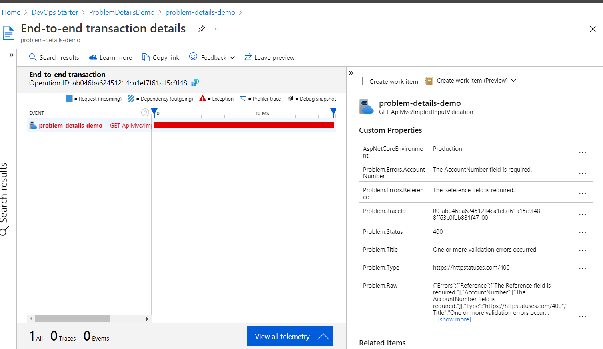

# ApplicationInsights.ProblemDetails [](https://dev.azure.com/christianacca/ApplicationInsights.ProblemDetails/_build/latest?definitionId=7&branchName=master)

## Overview

MS Application Insights integration for the Hellang.Middleware.ProblemDetails package.

_Enriches request telementry with custom dimensions extracted from a ProblemDetail response:_



## Usage

### Prerequisites

Ensure your ASP.Net Core application has been configured with:

* MS Application Insights SDK; see [official guidance](https://docs.microsoft.com/en-us/azure/azure-monitor/app/asp-net-core)
* [Hellang.Middleware.ProblemDetails](https://www.nuget.org/packages/Hellang.Middleware.ProblemDetails) package. For guidance see:
  * [sample code](https://github.com/khellang/Middleware/blob/master/samples/ProblemDetails.Sample/Program.cs)
  * [sample app](https://github.com/christianacca/ProblemDetailsDemo/blob/master/src/ProblemDetailsDemo.Api/Startup.cs)

### Steps

1. Install package

   ```cmd
   Install-Package CcAcca.ApplicationInsights.ProblemDetails
   ```

2. Register the library with .Net Core dependency injection system. In `Statup.ConfigureServices` method add:

   ```c#
   services.AddProblemDetailTelemetryInitializer()
   ```

## Configuration / customization

* Configure which ProblemDetail responses are sent to application insights:

   ```c#
   services.AddProblemDetailTelemetryInitializer(o => {
     o.ShouldSend = (ctx, problem) => problem.Status >= StatusCodes.Status500InternalServerError;
   })
   ```

* Configure which properties of an ProblemDetail should be sent to application insights:

   ```c#
  services.AddProblemDetailTelemetryInitializer(o => {
    o.IncludeErrorsValue = (ctx, problem) => !SensitiveUrl(ctx);
    o.IncludeExtensionsValue = (ctx, problem) => !SensitiveUrl(ctx);
    o.IncludeRawJson = (ctx, problem) => !SensitiveUrl(ctx);
  });
   ```

* Configure the values of the dimensions sent to application insights:

   ```c#
   services.AddProblemDetailTelemetryInitializer(o => {
    o.MapDimensions = (ctx, problem, dimensions) => {
      var sensitiveFields = new[] {"SSN", "SocialSecurityNumber", "AccountNumber"};
      var isSensitive = dimensions.Any(d => sensitiveFields.Any(f => d.Key.Contains(f)));
      var sanitized = isSensitive
        ? dimensions
          .Where(d =>
            !sensitiveFields.Concat(new[] {DefaultDimensionCollector.RawDimensionKey})
              .Any(f => d.Key.Contains(f)))
        : dimensions;
      return new Dictionary<string, string>(sanitized);
    };
  });
   ```

* Override the default serializer: see `ProblemDetailsTelemetryOptions.SerializeValue`
* Override the default dimension collector for low level control: see `DefaultDimensionCollector`

## Develop

To build and run tests you can use:

* the dotnet cli tool
* any IDE/editor that understands MSBuild eg Visual Studio or Visual Studio Code

### Recommended workflow

* Develop on a feature branch created from master:
  * create a branch from *master*.
  * perform all the code changes into the newly created branch.
  * merge *master* into your branch, then run tests locally (eg `dotnet test src/CcAcca.ApplicationInsights.ProblemDetails.Tests`)
  * on the new branch, bump the version number in [CcAcca.ApplicationInsights.ProblemDetails.csproj](src/CcAcca.ApplicationInsights.ProblemDetails/CcAcca.ApplicationInsights.ProblemDetails.csproj); follow [semver](https://semver.org/)
  * raise the PR (pull request) for code review & merge request to master branch.
  * PR will auto trigger a limited CI build (compile and test only)
  * approval of the PR will merge your branch code changes into the *master*

## CI server

Azure Devops is used to run the dotnet cli tool to perform the build and test. See the [yaml build definition](.azure-pipelines.yml) for details.

Notes:

* The CI build is configured to run on every commit to any branch
* PR completion to master will also publish the nuget package for CcAcca.ApplicationInsights.ProblemDetails to [Nuget gallery](https://www.nuget.org/packages/CcAcca.ApplicationInsights.ProblemDetails/)
